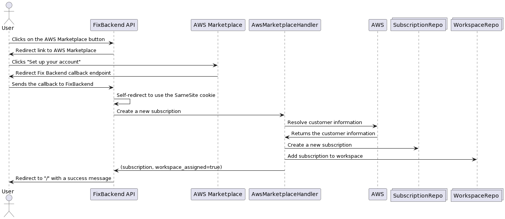
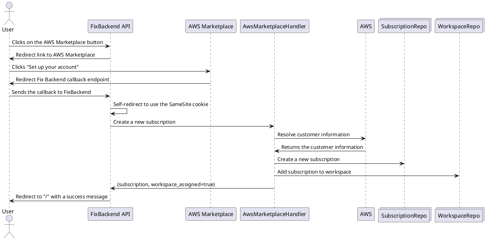
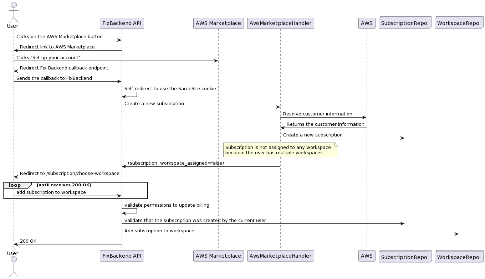
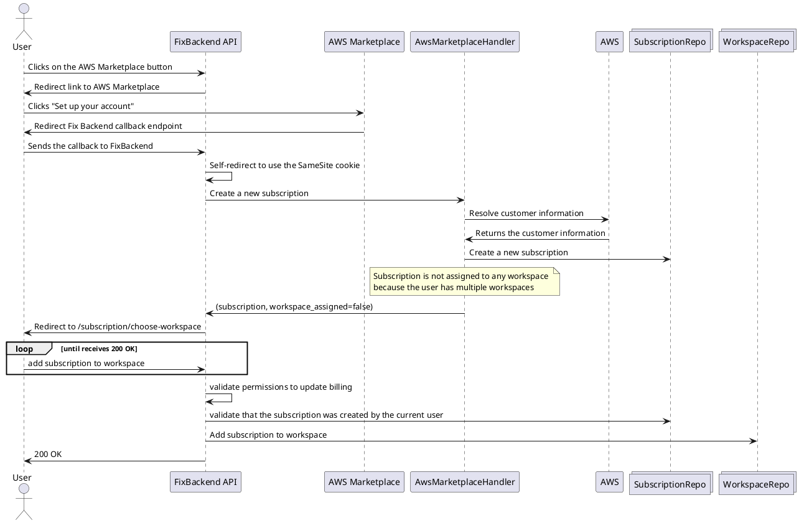
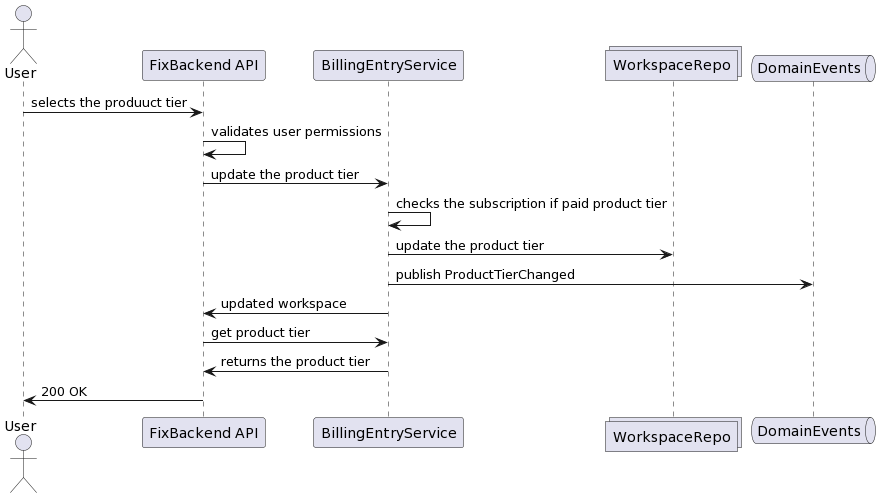
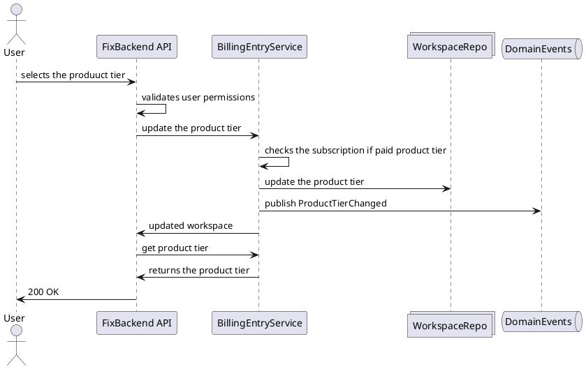

# Billing Flow

Here are a couple of diagrams that illustrate the billing flow. Setting up means getting a new AWS Marketplace subscription or doing the same flow with an existing subscription. 

## Setting up a subscription with a single workspace

Here is the base case where a user has a single workspace. The assignment of the subscription to the workspace is done automatically. Workspace selection dialog is not shown.

source

## Setting up subscription with multiple workspaces

A bit more complex case where a user has multiple workspaces. The subscription is not assigned to any workspace by default. Instead, the user is prompted to select a workspace to assign the subscription to.

source

## Updating the product tier

source

